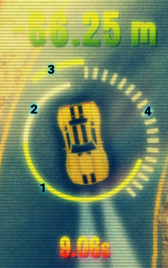

# uRacer: The King Of The Drift

A GLES2 top-down racer, built on top of [libgdx](https://github.com/libgdx/libgdx) and [Box2D](https://github.com/erincatto/Box2D).

## Disclaimer

*This project has been lying on my hard-drive for far too long, so i'm releasing it as an open source project in the hope it may be of use or maybe inspiration for someone else work.*

This project is now **unmaintained** and i don't plan to get back to working on it soon or in the foreseeable future.

This is based on a very old version of libgdx: some missing features at the time made me implement things differently and since updating everything would mean to probably rewrite lot of stuff, i'm just leaving it at that.

## Why open sourcing it?

Because there is no reason to not to.

Started in 2011, i realize i've put so much effort and hours of work into it that seeing it idling on my drive is simply non-sense.

This project is far from being complete, and while some parts looks fine, some parts i would really like to rewrite them from the start, but all in all it has been a pleasing coding adventure.


## Gameplay videos

Here are some *old videos* introducing the gameplay and the in-game mechanics: some menu screen elements and interactions have changed, but the core is mostly the same.

### *Curves* track
[](http://www.youtube.com/watch?v=81gYx5K3338)

### *Overlap* track
[](http://www.youtube.com/watch?v=1XHIVneYqa0)

### *Mistic Drift* track
[](http://www.youtube.com/watch?v=1JaQ55KrNqE)

## Game mechanics

The player has to perform the best time on any given track: his best laps get automatically recorded and replayed via *ghost* cars.

The idea was to enable players to share their best laps and have others to race against them.

At this time, much of this mechanic has been implemented already, however *no network client code* has made into uRacer yet, since i never had enough time to evolve the Netty-based client prototype.

By **drifting your car** you can *accumulate* an amount of seconds to spend in time dilation mode: while in this mode, you achieve more *fine-grained* control over the car behavior, thanks to the time being slowed down.

Every time you start playing a track, a warmup phase is initiated where you don't immediately start racing from the starting point, but from some meters behind.

## Networking

I've started working on a server prototype to handle clients to connect to and a live dashboard to keep track of the players and other information; the technology there is a **Twisted**-based server handling the networking protocol and a **Flask/Python** web application dashboard for controlling it, the client prototype was built on **Netty**.

Please note that *no network client code* has made into uRacer yet, since i never had enough time to evolve the Netty-based client prototype.

## Controls

The main menu interface is simple, you can obviously use your mouse to interact with the UI, or use the following keyboard shortcuts:

- use <kbd>UP</kbd> and <kbd>DOWN</kbd> to choose the track
- use <kbd>S</kbd> to **S**tart playing
- use <kbd>O</kbd> to go to a very basic graphic options screen
- use <kbd>Q</kbd> to quit or go back to the previous menu screen

Car controls are also pretty straightforward:

- by **keyboard**
  - use the<kbd>UP</kbd>, <kbd>LEFT</kbd> and <kbd>RIGHT</kbd> keys to **move**
  - use the <kbd>SPACE</kbd> to activate **time dilation**
- by **mouse**
  - left-click and drag to **move**
  - keep the right-click pressed to activate **time dilation**

In-game keys are the following:

- press <kbd>ESC</kbd> to toggle pause, this will popup a *sound options* screen:
  - you can tweak sound and music volumes
  - you can get back to the game by pressing <kbd>ESC</kbd> again
  - you can quit the game by pressing <kbd>Q</kbd>
- press <kbd>R</kbd> to restart the level at any time
- press <kbd>D</kbd> to enable debug mode
  - press <kbd>S</kbd> to toggle-view the game track sectorization
  - press <kbd>W</kbd> to toggle-view the box2d physical world
  - press <kbd>B</kbd> to toggle-view some static meshes bounding boxes

## HUD

The in-game HUD gives you information about a couple of things during the race:



1. the inner half-circle at the bottom (green to red) indicates the amount of seconds available for time dilation, the remaining seconds will also appear at the bottom of the HUD (`9.06s`)
2. the inner half-circle at the top (white) indicates the current drift strength (computed from the smoothed lateral forces)
3. the outer colored circle (green to red) indicates your **advantage** over other ghost cars if _clockwise_, or your **disadvantage** if _counter-clockwise_: the respective advantage/disadvantage distance in meters is also being shown, with positive numbers denoting an advantage (here is a disadvantage of `66.25m`)
4. the segmented middle circle (white) represents your track completion state

## Building from sources

Historically, the project has been developed within the Eclipse IDE, thus the integrated toolchain has been used to easily make use of hot-swapping Java code.

For this release i completely scratched that and refactored the dependencies as well, switching to a *Gradle-based* build.

### Resources

I'm providing also the original resource data (`uracer-desktop/data-src`) that has been used to produce the final resources that can be found in the directory `uracer-desktop/res/data`: the reason for this is to let you see how that data has been produced.

Since i'm not sure the scripts there can still be used to produce valid resources, this is why i'm also providing them within this repository as well.

### Prerequisites

- a Java compiler (tested with Oracle JDK 6/8/10)
- the [Gradle build tool](https://gradle.org)
- `git` if you want to produce a versioned build

### Compiling

Clone this repository:
```bash
git clone git@github.com:manuelbua/uracer-kotd.git
```

Move to the project directory and build it:
```bash
cd uracer-kotd
./gradlew build

..
BUILD SUCCESSFUL in 3s
5 actionable tasks: 5 executed
```

At this point you should find the just created distribution ZIP file in the `build/distributions` directory:
```bash
$ ls -l build/distributions/
total 106404
-rw-r--r-- 1 manuel users 56924160 Apr 22 20:22 uracer-kotd-0.9.4-NEXT.39+153d31c8.tar
-rw-r--r-- 1 manuel users 52030433 Apr 22 20:22 uracer-kotd-0.9.4-NEXT.39+153d31c8.zip
```

In case you are creating an unversioned build, then filenames will be missing the version information, such as `uracer-kotd.zip`.


## Running the game

Launching the game is also very simple: whether you downloaded the release from GitHub or you have compiled it yourself, you need to unpack it.

So move to the directory you downloaded it to or move to your build output directory, such as`build/distributions/`, and `unzip` it:
```bash
cd build/distributions
unzip uracer-kotd-0.9.4-NEXT.39+153d31c8.zip
```

At this point, move to the unpacked directory and execute the game with `--help` to look at the available command line parameters:
```bash
cd uracer-kotd-0.9.4-NEXT.39+153d31c8/
./bin/uracer-kotd --help

URacer: The King Of The Drift (0.9.4-NEXT.39+153d31c8)
Copyright (c) 2011-2018 Manuel Bua.

NO BOOT CONFIG AVAILABLE

Valid command-line options:
  --help                shows this help
  --resolution=RES      specify the resolution to use: you can either specify
                        a real resolution, e.g. --resolution=800x600, or use
                        a built-in shortcut (one of "low", "mid" or "high").
                        (low=800x480, mid=1280x800, high=1920x1080)
  --enable-vsync, --disable-vsync               enable/disable vertical sync
  --enable-fullscreen, --disable-fullscreen     enable/disable fullscreen
  --enable-undecorated, --disable-undecorated   whether or not to create a window without the window manager's decorations
```

Run it at `1920x1080` by specifying the `high` shortcut:
```bash
./bin/uracer-kotd --resolution=high

URacer: The King Of The Drift (0.9.4-NEXT.39+153d31c8)
Copyright (c) 2011-2018 Manuel Bua.

Resolution set at 1920x1080 (x=320, y=180)
Vertical sync: Yes
Fullscreen: No
Window decorations: Yes

URacer: Booting version 0.9.4-NEXT.39+153d31c8
URacer: GL vendor is NVIDIA Corporation
URacer: GL version is 4.6.0 NVIDIA 390.48
URacer: Java vendor is Oracle Corporation
URacer: Java version is 10.0.1
URacer: Using real frametime: YES
URacer: Physics at 60Hz (dT=0.01667)
..
```

Happy hacking!

## Credits

### In-game music

Thanks to [Clearside](http://www.clearsidemusic.com/) for letting me use his music in the game: the track being used is [My Mind Is Going](https://soundcloud.com/clearsidemusic/clearside-my-mind-is-going).

*Note that i'm not using the track as-is, but i sliced it to better fit my use-case.*

### Car and tileset graphic assets

Thanks to [Philipp Matz](https://it.linkedin.com/in/philipp-matz-b1156833) for creating all of the car graphics, tilesets and his ideas for improvement, awesome work!

### Car engine sound modeling

I initially tried to develop a pitch-based car engine sound simulator, but i didn't like the sound as it was obviously too "synthesized".

I realized that a *fuzzy logic inference system* was worth a try, but i never had any experience on that: after studying the subject for some weeks with the help of this [incredibly costly book](https://www.amazon.com/Introduction-Fuzzy-Logic-Practical-Applications/dp/0387948074), i found an interesting [Assigment Report](/docs/car-engine-FUZZY_Assignment_Ptacek.pdf) by *Ptacek Mathias* on the subject and i immediately loved it, thanks for sharing your work!

I implemented the system in Java by using the [jFuzzyLogic](http://jfuzzylogic.sourceforge.net) library.

### Car physics

After *a lot of digging* i can finally credit *Marco Monster* as the author of the original car physics i've modified and now using. His [now archived post](http://www.asawicki.info/Mirror/Car%20Physics%20for%20Games/Car%20Physics%20for%20Games.html) dates back to 2003 and it's version 1.9, thanks for sharing that gem!

### 2D lighting system

If i remember correctly, i'm using a modified version of the [box2dlights](https://github.com/libgdx/box2dlights) library by Kalle Hamalainen, thanks for building it!

I don't remember clearly why i had to modify the original source code, but it was probably related to the fact i wanted to filter out some Box2D fixtures, the ability to make ray queries in some way and using a [PingPongBuffer](https://github.com/manuelbua/libgdx-contribs/blob/master/postprocessing/src/main/java/com/bitfire/postprocessing/utils/PingPongBuffer.java) for rendering.

### Other assets

I personally bought every asset where needed, as to comply with the proper licensing model for each.

Much of the remaining assets are either in the public domain or done by me.

In case i'm missing something or i'm overlooking something please let me know, thanks!

## License

This work is being distributed under the [Apache License 2.0](./LICENSE).

## Code reuse

If you want to re-use ideas, code or whatever, please do it! There is **no need** for licenses, donations or whatnot, really.

If you really want to send me some gold you have some choices:
- send **pennys** via [https://paypal.me/ManuelBua](https://paypal.me/ManuelBua)
- send **bitcoins** to `1DBcRkXwSFsc21pCajkodFirjfcfpmi8Ek`
- send **ethers** to `0x090C9c77865820CF146b5B6a297fC5A5505a6953`

PS: if you want to send me some *real gold*, please contact me privately beforehand :D

